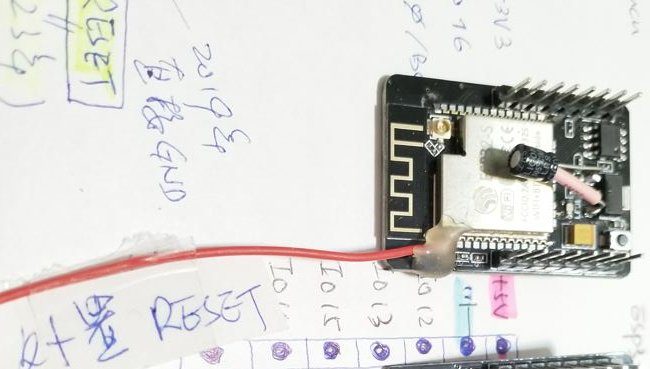
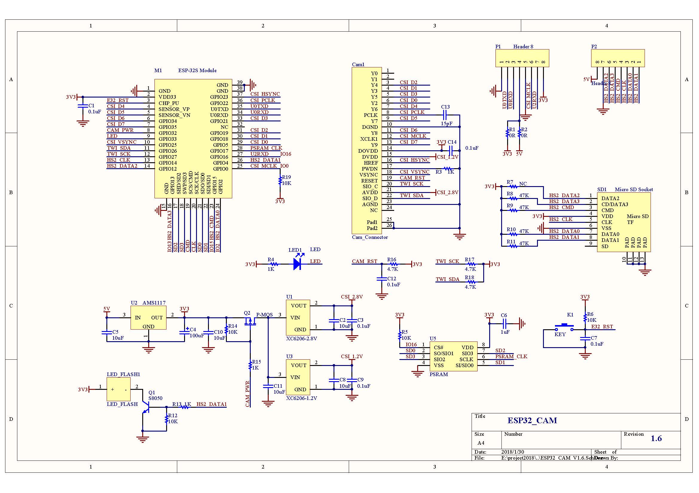
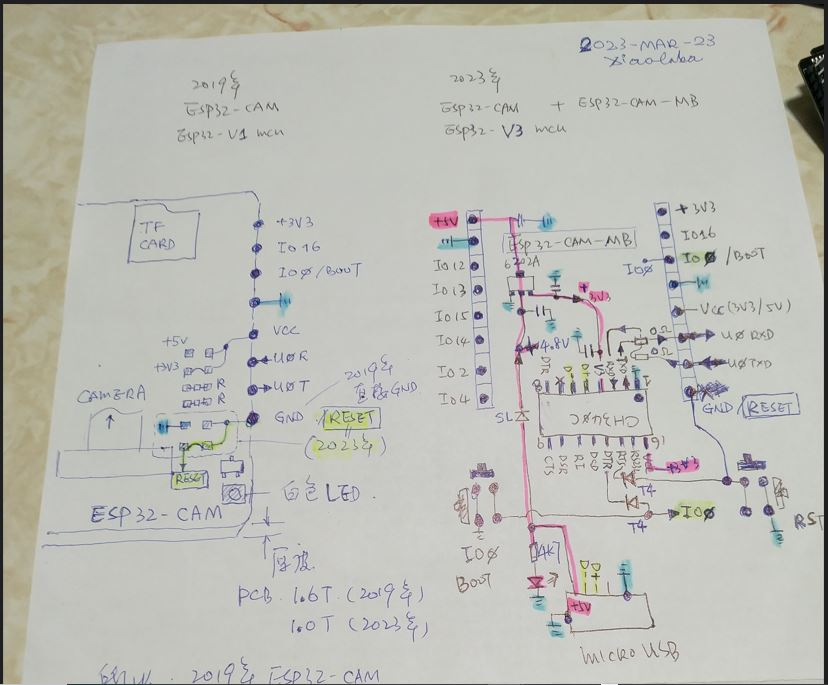
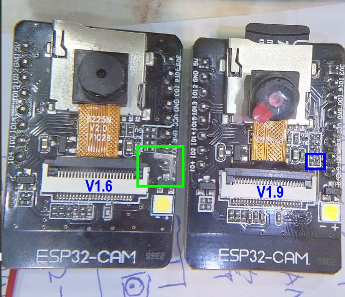

# ESP32-CAM_V1.6_V1.9_MB
ESP32-CAM-MB, base module design, schematic, ESP32-CAM V1.6 modification to uses external RESET pin and the auto download

### Ai-thinker ESP32-CAM, no exposed RESET pin  
either clone or the original design, ESP32-S module pin3 = RESET, only connected to RST button, no external assessment pin. not so user friendly, so it was workaround to solder a wire for the purpose. It was selling without USB-UART chip, either no the ESP32-CAM-MB bundled. The ESP32 core is V1, vulnerable to rom dump.  

  

  

see log here, 
https://github.com/xiaolaba/ESP32-CAM_blink  
https://github.com/xiaolaba/ESP32-CAM_OV2460_testing  
https://github.com/xiaolaba/ESP32-CAM-SD  
https://github.com/xiaolaba/ESP32_SD_Test_SPI-14-2-15-13  

### ESP32-CAM V1.9, selling with ESP32-CAM-MB bundled  
a new version, slightly modified design, RESET pin connected to one spare GND pin, 2 more resistors included, we may call ESP32-CAM V1.9. The ESP32 core is V3, but metal can is identical laser marking of ESP32-S & FCC ID. the is no schematic, but a hand written copy is obtained

  

### ESP32-CAM V1.6, how to upgrade to V1.9 to uses with ESP32-CAM-MB
cut the PCB trace, isolate the GND connection, solder a wire from ESP32-S reset point to the pinhead  
  

